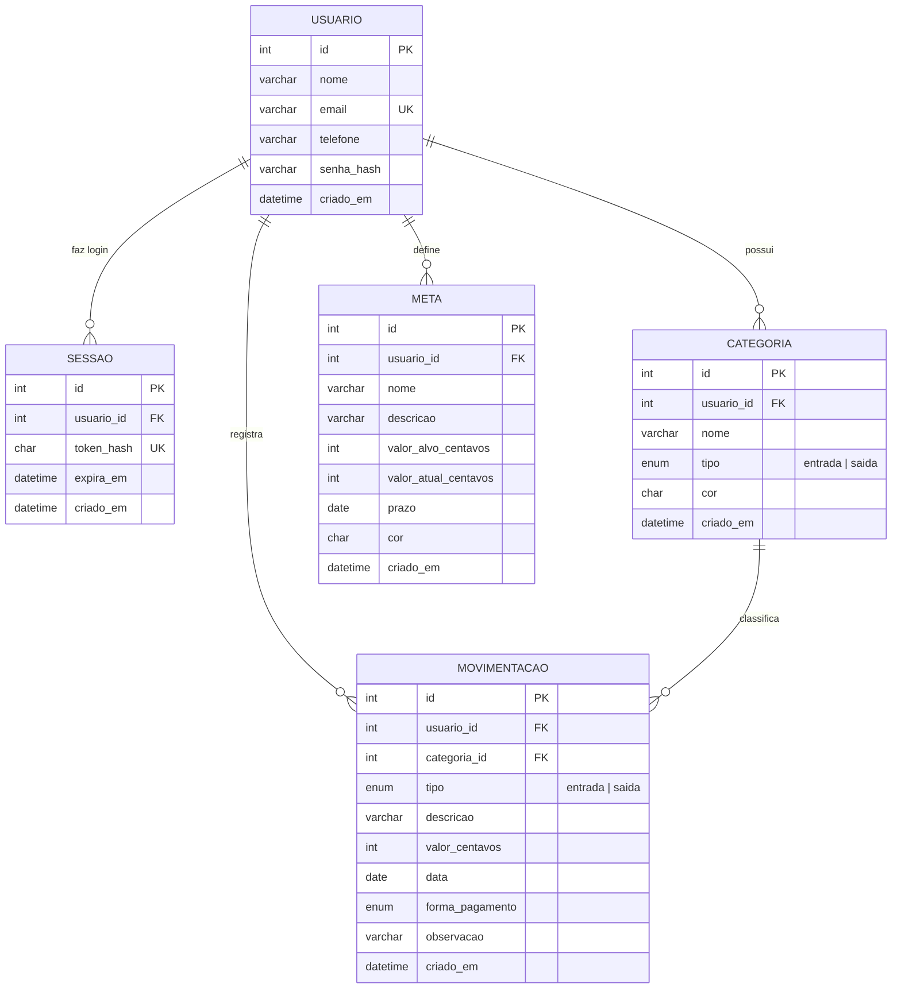

# Banco de dados — Corta Aí

Banco **MySQL** (ou MariaDB, que vem no XAMPP) chamado `corta_ai`.
O script completo de criação está em [`backend/database/schema.sql`](../backend/database/schema.sql)
e o comando `php backend/database/setup.php` cria o banco, as tabelas e a conta de demonstração.

## Diagrama entidade-relacionamento



## Dicionário de dados

### `usuario`
| Coluna      | Tipo          | Descrição                                      |
| ----------- | ------------- | ---------------------------------------------- |
| id          | INT (PK)      | Identificador, gerado automaticamente          |
| nome        | VARCHAR(80)   | Nome completo                                  |
| email       | VARCHAR(120)  | E-mail de login (único)                        |
| telefone    | VARCHAR(15)   | Telefone com DDD, ex.: (47) 99999-8888         |
| senha_hash  | VARCHAR(255)  | Senha criptografada com bcrypt (`password_hash`) |
| criado_em   | DATETIME      | Data do cadastro                               |

### `sessao`
| Coluna      | Tipo          | Descrição                                            |
| ----------- | ------------- | ---------------------------------------------------- |
| id          | INT (PK)      |                                                      |
| usuario_id  | INT (FK)      | Dono da sessão                                       |
| token_hash  | CHAR(64)      | SHA-256 do token de login (o token puro fica só no navegador) |
| expira_em   | DATETIME      | 30 dias com “manter conectado”, 12 horas sem         |

### `categoria`
| Coluna      | Tipo                      | Descrição                                   |
| ----------- | ------------------------- | ------------------------------------------- |
| id          | INT (PK)                  |                                             |
| usuario_id  | INT (FK)                  | Cada usuário tem as suas categorias         |
| nome        | VARCHAR(30)               | Único por usuário + tipo                    |
| tipo        | ENUM('entrada','saida')   | Origem (entrada) ou destino (saída)         |
| cor         | CHAR(7)                   | Cor em hexadecimal, ex.: `#10b981`          |

### `movimentacao`
| Coluna           | Tipo                    | Descrição                                            |
| ---------------- | ----------------------- | ---------------------------------------------------- |
| id               | INT (PK)                |                                                      |
| usuario_id       | INT (FK)                |                                                      |
| categoria_id     | INT (FK)                | Não permite excluir uma categoria em uso (RESTRICT)  |
| tipo             | ENUM('entrada','saida') | RF-03 / RF-04                                        |
| descricao        | VARCHAR(60)             |                                                      |
| valor_centavos   | INT UNSIGNED            | Valor em centavos, sempre > 0 (R$ 12,34 = 1234)      |
| data             | DATE                    | Data da movimentação                                 |
| forma_pagamento  | ENUM                    | dinheiro, pix, debito, credito, boleto, transferencia |
| observacao       | VARCHAR(200) NULL       | Opcional                                             |

### `meta`
| Coluna                | Tipo           | Descrição                        |
| --------------------- | -------------- | -------------------------------- |
| id                    | INT (PK)       |                                  |
| usuario_id            | INT (FK)       |                                  |
| nome                  | VARCHAR(40)    |                                  |
| descricao             | VARCHAR(120)   | Opcional                         |
| valor_alvo_centavos   | INT UNSIGNED   | Quanto quer juntar (> 0)         |
| valor_atual_centavos  | INT UNSIGNED   | Quanto já guardou                |
| prazo                 | DATE           |                                  |
| cor                   | CHAR(7)        |                                  |

## Regras importantes

- **Valores em centavos (INT)**: evita os erros de arredondamento de `FLOAT`/`DOUBLE`.
- **RNF-02 (Segurança)**: todas as consultas da API filtram por `usuario_id` do usuário do token.
- **Senhas** nunca são salvas em texto: `password_hash()` (bcrypt) no cadastro e `password_verify()` no login.
- **SQL Injection**: todas as consultas usam *prepared statements* do PDO (`?` nos parâmetros).
- Ao **excluir a conta**, a API apaga movimentações, metas, categorias e sessões do usuário.
- `utf8mb4_unicode_ci`: a busca e a verificação de nomes repetidos ignoram maiúsculas e acentos.

## Consultas de exemplo

```sql
-- Saldo atual do usuário 1
SELECT SUM(CASE WHEN tipo = 'entrada' THEN valor_centavos ELSE -valor_centavos END) / 100 AS saldo_reais
FROM movimentacao WHERE usuario_id = 1;

-- Saídas por categoria em setembro/2026
SELECT c.nome, SUM(m.valor_centavos) / 100 AS total_reais
FROM movimentacao m
JOIN categoria c ON c.id = m.categoria_id
WHERE m.usuario_id = 1 AND m.tipo = 'saida' AND m.data BETWEEN '2026-09-01' AND '2026-09-30'
GROUP BY c.nome
ORDER BY total_reais DESC;

-- Progresso das metas
SELECT nome, ROUND(valor_atual_centavos / valor_alvo_centavos * 100) AS progresso_pct
FROM meta WHERE usuario_id = 1;
```
