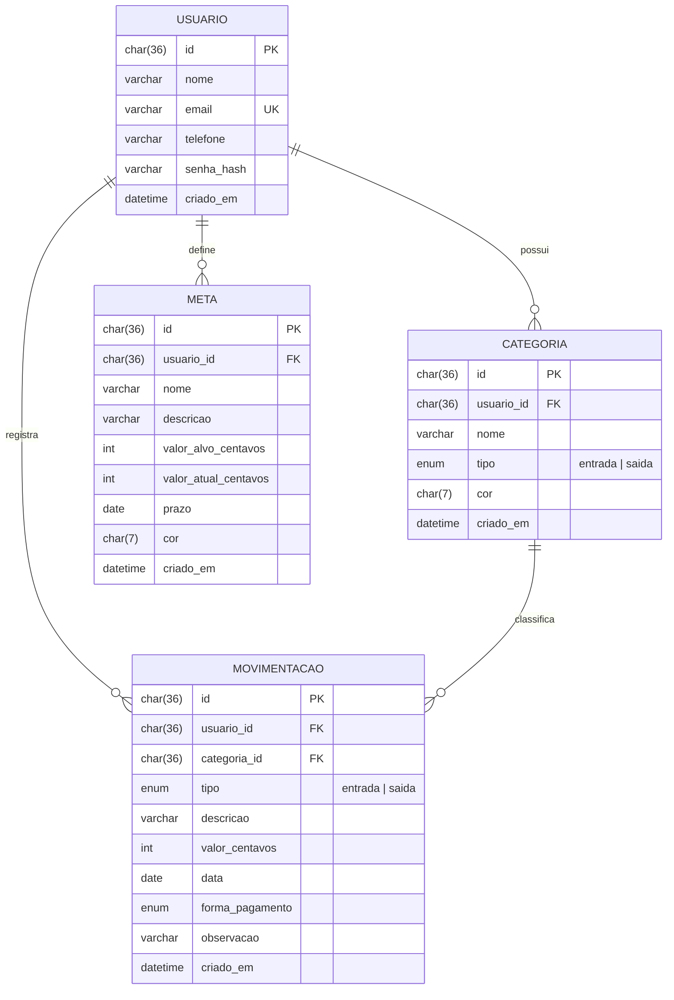

# Banco de dados — Corta Aí

O front-end já trabalha com a mesma estrutura de tabelas abaixo (ver `src/types/index.ts` e
`src/services/storage.ts`). Enquanto a API não existe, os dados ficam no `localStorage`; o
script SQL a seguir é o modelo para o banco definitivo (MySQL/MariaDB).

## Diagrama entidade-relacionamento



## Script SQL (MySQL 8)

```sql
CREATE DATABASE IF NOT EXISTS corta_ai CHARACTER SET utf8mb4 COLLATE utf8mb4_unicode_ci;
USE corta_ai;

CREATE TABLE usuario (
  id          CHAR(36)     NOT NULL PRIMARY KEY,
  nome        VARCHAR(80)  NOT NULL,
  email       VARCHAR(120) NOT NULL UNIQUE,
  telefone    VARCHAR(15)  NOT NULL,
  senha_hash  VARCHAR(255) NOT NULL,           -- bcrypt/argon2, nunca a senha pura
  criado_em   DATETIME     NOT NULL DEFAULT CURRENT_TIMESTAMP
);

CREATE TABLE categoria (
  id          CHAR(36)    NOT NULL PRIMARY KEY,
  usuario_id  CHAR(36)    NOT NULL,
  nome        VARCHAR(30) NOT NULL,
  tipo        ENUM('entrada','saida') NOT NULL,
  cor         CHAR(7)     NOT NULL DEFAULT '#10b981',
  criado_em   DATETIME    NOT NULL DEFAULT CURRENT_TIMESTAMP,
  CONSTRAINT fk_categoria_usuario FOREIGN KEY (usuario_id) REFERENCES usuario(id) ON DELETE CASCADE,
  CONSTRAINT uq_categoria UNIQUE (usuario_id, tipo, nome)
);

CREATE TABLE movimentacao (
  id              CHAR(36)    NOT NULL PRIMARY KEY,
  usuario_id      CHAR(36)    NOT NULL,
  categoria_id    CHAR(36)    NOT NULL,
  tipo            ENUM('entrada','saida') NOT NULL,
  descricao       VARCHAR(60) NOT NULL,
  valor_centavos  INT UNSIGNED NOT NULL CHECK (valor_centavos > 0),
  data            DATE        NOT NULL,
  forma_pagamento ENUM('dinheiro','pix','debito','credito','boleto','transferencia') NOT NULL,
  observacao      VARCHAR(200) NULL,
  criado_em       DATETIME    NOT NULL DEFAULT CURRENT_TIMESTAMP,
  CONSTRAINT fk_mov_usuario   FOREIGN KEY (usuario_id)   REFERENCES usuario(id)   ON DELETE CASCADE,
  CONSTRAINT fk_mov_categoria FOREIGN KEY (categoria_id) REFERENCES categoria(id) ON DELETE RESTRICT,
  INDEX idx_mov_usuario_data (usuario_id, data)
);

CREATE TABLE meta (
  id                   CHAR(36)     NOT NULL PRIMARY KEY,
  usuario_id           CHAR(36)     NOT NULL,
  nome                 VARCHAR(40)  NOT NULL,
  descricao            VARCHAR(120) NULL,
  valor_alvo_centavos  INT UNSIGNED NOT NULL CHECK (valor_alvo_centavos > 0),
  valor_atual_centavos INT UNSIGNED NOT NULL DEFAULT 0,
  prazo                DATE         NOT NULL,
  cor                  CHAR(7)      NOT NULL DEFAULT '#10b981',
  criado_em            DATETIME     NOT NULL DEFAULT CURRENT_TIMESTAMP,
  CONSTRAINT fk_meta_usuario FOREIGN KEY (usuario_id) REFERENCES usuario(id) ON DELETE CASCADE
);
```

### Regras importantes

- **Valores em centavos (INT)**: `R$ 12,34` é salvo como `1234`. Evita erros de arredondamento de `FLOAT`.
- **RNF-02 (Segurança)**: toda consulta da API deve filtrar por `usuario_id` do usuário autenticado.
- `ON DELETE CASCADE` no usuário: ao excluir a conta, todos os dados dele são apagados.
- `ON DELETE RESTRICT` na categoria: não é possível excluir uma categoria que tem movimentações
  (mesma regra aplicada na tela de Categorias).

### Consultas de exemplo

```sql
-- Saldo atual do usuário
SELECT SUM(CASE WHEN tipo = 'entrada' THEN valor_centavos ELSE -valor_centavos END) AS saldo
FROM movimentacao WHERE usuario_id = ?;

-- Saídas por categoria em um mês
SELECT c.nome, SUM(m.valor_centavos) AS total
FROM movimentacao m JOIN categoria c ON c.id = m.categoria_id
WHERE m.usuario_id = ? AND m.tipo = 'saida' AND m.data BETWEEN '2026-09-01' AND '2026-09-30'
GROUP BY c.nome ORDER BY total DESC;
```
