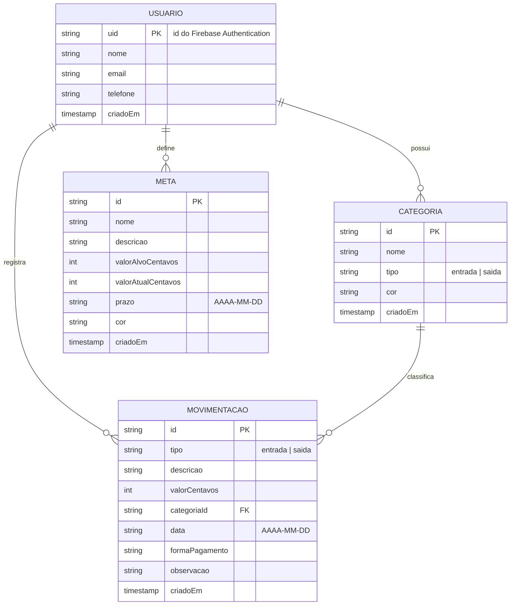

# Banco de dados — Corta Aí

Banco **Cloud Firestore** (NoSQL, do Firebase), projeto `corta-ai-bd1c1`.
Login e senha ficam no **Firebase Authentication**: a senha nunca é gravada no Firestore.
As regras de acesso estão em [`firestore.rules`](../firestore.rules).

## Estrutura (coleções e documentos)

Cada usuário tem um documento em `usuarios`, e os dados dele ficam em **subcoleções** desse
documento. Assim, tudo o que pertence a um usuário fica "dentro" dele.

```
usuarios/{uid}                          ← uid = id do usuário no Firebase Authentication
 ├── categorias/{id}
 ├── movimentacoes/{id}
 └── metas/{id}
```


```mermaid
erDiagram
  USUARIO ||--o{ CATEGORIA : possui
  USUARIO ||--o{ MOVIMENTACAO : registra
  USUARIO ||--o{ META : define
  CATEGORIA ||--o{ MOVIMENTACAO : classifica

  USUARIO {
    string uid PK "id do Firebase Authentication"
    string nome
    string email
    string telefone
    timestamp criadoEm
  }
  CATEGORIA {
    string id PK
    string nome
    string tipo "entrada | saida"
    string cor
    timestamp criadoEm
  }
  MOVIMENTACAO {
    string id PK
    string tipo "entrada | saida"
    string descricao
    int valorCentavos
    string categoriaId FK
    string data "AAAA-MM-DD"
    string formaPagamento
    string observacao
    timestamp criadoEm
  }
  META {
    string id PK
    string nome
    string descricao
    int valorAlvoCentavos
    int valorAtualCentavos
    string prazo "AAAA-MM-DD"
    string cor
    timestamp criadoEm
  }
```

## Campos

**`usuarios/{uid}`**

| Campo      | Tipo      | Descrição                          |
| ---------- | --------- | ---------------------------------- |
| `nome`     | string    | Nome completo                      |
| `email`    | string    | E-mail (o mesmo do login)          |
| `telefone` | string    | Telefone com máscara               |
| `criadoEm` | timestamp | Data do cadastro                   |

**`usuarios/{uid}/categorias/{id}`**: origem das entradas e destino das saídas.

| Campo      | Tipo      | Descrição                          |
| ---------- | --------- | ---------------------------------- |
| `nome`     | string    | Ex.: Salário, Alimentação          |
| `tipo`     | string    | `entrada` ou `saida`               |
| `cor`      | string    | Cor em hexadecimal (`#10b981`)     |
| `criadoEm` | timestamp | Data de criação                    |

**`usuarios/{uid}/movimentacoes/{id}`**: entradas (RF-03) e saídas (RF-04).

| Campo            | Tipo      | Descrição                                                   |
| ---------------- | --------- | ----------------------------------------------------------- |
| `tipo`           | string    | `entrada` ou `saida`                                        |
| `descricao`      | string    | Ex.: Mercado do mês                                         |
| `valorCentavos`  | int       | Valor em centavos (`R$ 12,34` = `1234`)                     |
| `categoriaId`    | string    | id do documento em `categorias`                             |
| `data`           | string    | Data da movimentação (`AAAA-MM-DD`)                         |
| `formaPagamento` | string    | `pix`, `dinheiro`, `debito`, `credito`, `boleto`, `transferencia` |
| `observacao`     | string    | Opcional                                                    |
| `criadoEm`       | timestamp | Data do registro                                            |

**`usuarios/{uid}/metas/{id}`**: metas financeiras (RF-05).

| Campo                | Tipo      | Descrição                      |
| -------------------- | --------- | ------------------------------ |
| `nome`               | string    | Ex.: Reserva de emergência     |
| `descricao`          | string    | Opcional                       |
| `valorAlvoCentavos`  | int       | Valor que se quer juntar       |
| `valorAtualCentavos` | int       | Valor já guardado              |
| `prazo`              | string    | Data limite (`AAAA-MM-DD`)     |
| `cor`                | string    | Cor em hexadecimal             |
| `criadoEm`           | timestamp | Data de criação                |

## Regras de negócio

- Valores em dinheiro são guardados em **centavos (inteiros)**, para não ter erro de arredondamento.
- Ao se cadastrar, o usuário já recebe as **categorias padrão** (5 de entrada e 9 de saída).
- Uma categoria **não pode ser excluída** nem mudar de tipo se já tiver movimentações.
- A categoria de uma movimentação precisa ser do mesmo tipo dela (entrada ou saída).
- Guardar e retirar dinheiro de uma meta usa uma **transação** do Firestore; não é possível
  retirar mais do que já foi guardado.
- Ao excluir a conta, todos os documentos do usuário são apagados.

## Segurança (RNF-02)

As regras em [`firestore.rules`](../firestore.rules) garantem que:

- só um usuário **logado** acessa o banco;
- cada usuário só lê e grava `usuarios/{seu uid}` e as subcoleções dele;
- os campos principais têm o tipo certo (ex.: `valorCentavos` inteiro e maior que zero,
  `tipo` só `entrada` ou `saida`).
