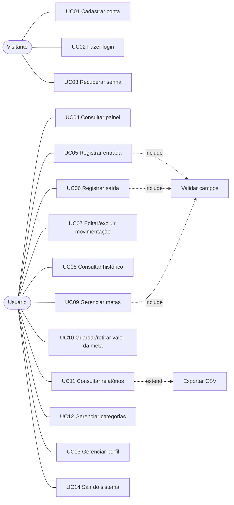

# Casos de uso — Corta Aí

## Atores

- **Visitante** — pessoa que ainda não está logada.
- **Usuário** — pessoa cadastrada e autenticada no sistema.

## Diagrama (resumo)

---

## UC01 — Cadastrar conta (RF-01)

| Item | Descrição |
| --- | --- |
| Ator | Visitante |
| Pré-condição | Não estar logado |
| Pós-condição | Conta criada, categorias padrão criadas e usuário logado |

**Fluxo principal**
1. O visitante acessa **Criar conta**.
2. Informa nome, e-mail, telefone, senha e confirmação da senha, e aceita os termos.
3. O sistema valida os campos.
4. O sistema cria a conta e as categorias padrão.
5. O sistema exibe a mensagem de sucesso e abre o painel.

**Fluxos alternativos**
- 3a. Campo inválido (e-mail sem “@”, telefone sem DDD, senha fraca, senhas diferentes): o sistema mostra a mensagem abaixo do campo.
- 4a. E-mail já cadastrado: o sistema informa “Já existe uma conta cadastrada com este e-mail”.

## UC02 — Fazer login (RF-02)

| Item | Descrição |
| --- | --- |
| Ator | Visitante |
| Pré-condição | Possuir conta |
| Pós-condição | Usuário autenticado |

**Fluxo principal**
1. O visitante informa e-mail e senha (e opcionalmente “Manter conectado”).
2. O sistema valida as credenciais.
3. O sistema abre o painel (ou a página que o usuário tentou acessar antes).

**Fluxos alternativos**
- 2a. Credenciais inválidas: mensagem “E-mail ou senha incorretos” (sem revelar qual dos dois está errado).

## UC03 — Recuperar senha

1. O visitante clica em **Esqueceu a senha?** e informa o e-mail.
2. O sistema exibe a confirmação de envio das instruções.

## UC04 — Consultar painel

1. O usuário acessa **Painel**.
2. O sistema exibe saldo atual, entradas, saídas e economia do mês, gráfico dos últimos 6 meses, gastos por categoria, últimas movimentações e metas em andamento.
3. O usuário pode trocar o mês exibido.

## UC05 — Registrar entrada (RF-03)

| Item | Descrição |
| --- | --- |
| Ator | Usuário |
| Pré-condição | Estar logado |
| Pós-condição | Entrada salva e saldo atualizado |

**Fluxo principal**
1. O usuário clica em **Nova entrada** (ou **Nova movimentação** → Entrada).
2. Informa descrição, valor, data, origem (categoria), forma de recebimento e observação (opcional).
3. O sistema valida os campos.
4. O sistema salva e mostra “Entrada registrada!”.
5. Painel, listas e relatórios são atualizados imediatamente (RNF-06).

**Fluxos alternativos**
- 3a. Valor zerado ou campo obrigatório vazio: mensagem de validação no campo.

## UC06 — Registrar saída (RF-04)

Igual ao UC05, com o tipo **Saída** e a categoria indicando com o que o dinheiro foi gasto.

## UC07 — Editar/excluir movimentação

1. O usuário clica no ícone de lápis (editar) ou lixeira (excluir) de uma movimentação.
2. Na edição, o formulário abre preenchido; na exclusão, o sistema pede confirmação.
3. O sistema salva/remove e atualiza os totais.

## UC08 — Consultar histórico

1. O usuário acessa **Histórico**.
2. Pode filtrar por tipo, mês (ou todo o período), categoria e buscar pela descrição.
3. O sistema lista as movimentações agrupadas por dia com os totais do período.
4. (Extensão) O usuário pode **exportar CSV**.

## UC09 — Gerenciar metas (RF-05)

1. O usuário acessa **Metas** e clica em **Nova meta**.
2. Informa nome, valor da meta, valor já guardado, prazo, descrição e cor.
3. O sistema valida (valor guardado não pode ser maior que a meta) e salva.
4. O sistema mostra o progresso, o prazo restante e quanto guardar por mês.

## UC10 — Guardar/retirar valor da meta

1. O usuário clica em **Guardar dinheiro** em uma meta.
2. Escolhe **Guardar** ou **Retirar** e informa o valor (o sistema mostra a prévia do progresso).
3. O sistema atualiza a meta. Ao atingir 100%, exibe “Parabéns! Meta alcançada!”.
- 2a. Retirada maior que o valor guardado: mensagem de erro.

## UC11 — Consultar relatórios

1. O usuário acessa **Relatórios** e escolhe o período (3, 6 ou 12 meses).
2. O sistema exibe totais, gráficos de entradas x saídas e evolução do resultado, gastos por categoria, entradas por origem, resumo mensal em tabela e maiores gastos.

## UC12 — Gerenciar categorias

1. O usuário acessa **Categorias**, escolhe Entradas ou Saídas.
2. Cria, edita (nome, tipo, cor) ou exclui categorias.
- Categoria com movimentações não pode ser excluída.

## UC13 — Gerenciar perfil

1. O usuário acessa **Meu perfil**.
2. Pode alterar nome, e-mail e telefone; trocar a senha (informando a atual); ou excluir a conta (com confirmação).

## UC14 — Sair do sistema

1. O usuário clica no ícone de sair no menu.
2. O sistema encerra a sessão e volta para a tela de login.
